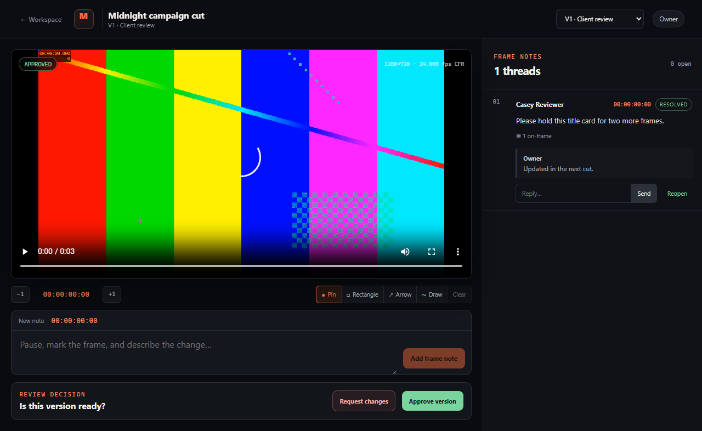

# Marktake

**Review the cut, mark the moment.**

Marktake is a focused, self-hosted review server for browser-ready video cuts. An
editor uploads a review copy, sends a private link, and gets frame-linked notes,
on-frame markups, threaded replies, versions, and a clear approval decision.



## Why this exists

Small creative teams often need the useful middle of a review platform, not a
media asset manager, project suite, or another cloud storage bill. Marktake keeps
that middle intentionally small:

- one container and one persistent data volume;
- no reviewer account;
- frame-linked comments and normalized on-frame pins, rectangles, arrows, and
  freehand marks;
- threaded replies, resolved state, ordered versions, and approval or change
  requests;
- local SQLite and local review copies;
- no product analytics, external fonts, third-party media calls, AI, or
  background transcoding service.

The original master remains in your edit storage. Marktake stores only the
browser-ready copy you choose to upload.

The separate public landing page uses our self-hosted Umami instance for
aggregate page, bounded CTA, section, scroll-depth, and engaged-time events. It
respects Do Not Track and Global Privacy Control, sets no analytics cookies, and
receives neither review media nor activity from self-hosted Marktake instances.
URLs are reduced to the landing root plus safe, bounded standard UTM values,
and referrer paths are removed before sending.

## Quick start

Requirements: Docker with Compose and a random administrator password of at
least 12 characters.

```bash
git clone https://github.com/arturict/marktake.git
cd marktake
export MARKTAKE_ADMIN_PASSWORD="$(openssl rand -base64 32)"
docker compose up -d
```

Open `http://localhost:4180`. On PowerShell, set the environment variable with:

```powershell
$env:MARKTAKE_ADMIN_PASSWORD = [Convert]::ToBase64String(
  [Security.Cryptography.RandomNumberGenerator]::GetBytes(32)
)
docker compose up -d
```

For an internet-facing instance, put Marktake behind an HTTPS reverse proxy,
set `MARKTAKE_PUBLIC_URL` to the exact external origin, and set
`MARKTAKE_SECURE_COOKIES=true`. See [deployment](docs/deployment.md) before
exposing it.

## Supported media

Marktake validates the real file signature and media streams, strips container
metadata by remuxing, and rejects unsupported uploads. It does not transcode.

| Container | Video      | Audio          | Frame rate             |
| --------- | ---------- | -------------- | ---------------------- |
| MP4       | H.264      | AAC or MP3     | Constant, 1 to 240 fps |
| WebM      | VP8 or VP9 | Opus or Vorbis | Constant, 1 to 240 fps |

Variable-frame-rate files, HEVC, ProRes, image sequences, still images, and audio
only files are outside v0.1. Export a small H.264 review copy first. Timecode is
nominal `HH:MM:SS:FF`; drop-frame notation is not implemented.

Defaults are 512 MiB per upload and 5 GiB total storage. Both are configurable,
but the reverse proxy must enforce compatible limits.

## Security model

- The administrator uses one server-configured password.
- Guest secrets are generated randomly, stored only as SHA-256 hashes, and kept
  in the URL fragment until exchanged for an HTTP-only, same-site session cookie.
- Optional guest passwords use scrypt.
- Every write requires a per-session CSRF token and an allowed origin.
- Guest database queries are scoped to the project behind their share link.
- Revoking or expiring a share link invalidates its existing guest sessions.
- Media responses require a valid session and support authenticated byte ranges.
- Upload names never become storage paths. Stored filenames are random UUIDs.
- CSP, no-referrer, restrictive permissions policy, rate limits, and no external
  assets are enabled by default.

Read [SECURITY.md](SECURITY.md) and the
[security architecture](docs/architecture.md#security-boundaries). Marktake v0.1
does not provide multi-user accounts, audit logs, antivirus scanning, DRM,
watermarking, or end-to-end encryption.

## Data and backups

The `/data` volume contains:

- `marktake.sqlite`, including projects, comments, sessions, and hashed secrets;
- `media/`, containing metadata-stripped review copies;
- `tmp/`, used only during active uploads.

Back up the database and media directory together while the container is stopped,
or use a SQLite-safe snapshot procedure. Restoring only one side can leave media
rows or files unmatched.

## Development

Requirements: Node.js 24+, pnpm 11.16.0, Docker, and the Playwright browsers for
end-to-end tests.

```bash
pnpm install
pnpm check
pnpm test:coverage
docker build -t marktake:local .
```

`pnpm check` runs formatting, linting, type checking, unit and integration tests,
and production builds. The container-backed Playwright suite exercises the full
creator and guest journey in Chromium, Firefox, and WebKit in CI.

## Project documents

- [Product evidence and competitive boundary](docs/product-research.md)
- [Architecture and security boundaries](docs/architecture.md)
- [Deployment and operations](docs/deployment.md)
- [Name screen](docs/naming.md)
- [Roadmap](ROADMAP.md)
- [Contributing](CONTRIBUTING.md)
- [Changelog](CHANGELOG.md)

## License

[MIT](LICENSE). Marktake is an independent project and is not affiliated with
Frame.io, Adobe, Loom, Atlassian, or any other reviewed product.
